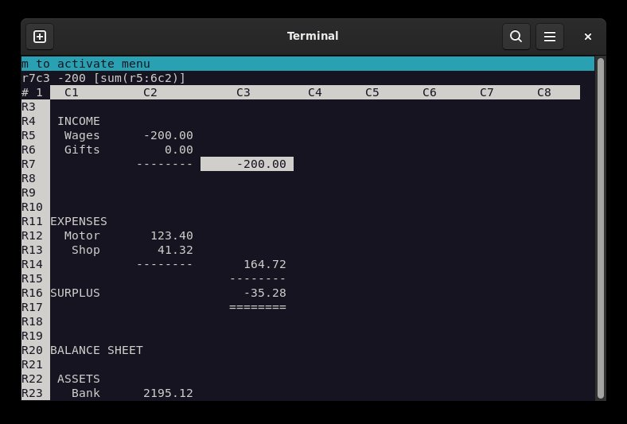

# Neoleo

Lightweight curses spreadsheet based on GNU oleo.

## Quick start

Absolute minimum you need to know:
* `=` to edit a cell
* `C-s` to save a file
* `C-q` to quit
* `C-g` cancels any edits you are making

There is plenty more to keep you amused. Type `info neoleo` to find out more.

## See also

[INSTALL](INSTALL.md) - installation instructions

[NEWS](NEWS.txt) - for latest and past versions

## Documents and examples

Neoleo installs examples in a shared directory, typically
    /usr/local/share/neoleo/examples/
or
    /usr/share/neoleo/examples/

## Links

*  [edorig](https://github.com/edorig/oleo) oleo github page
*  [freshcode](http://freshcode.club/projects/neoleo) announcement
*  [papoanaya](https://github.com/papoanaya/oleo) oleo github page

