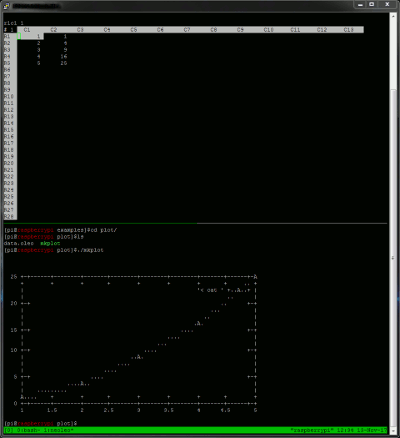

# Plotting using neoleo

Neoleo does not have any direct functionality for
creating plots, but they can be achieved using pipes
in a variety of ways.

You could write a shell script that is executable
from within neoleo and output to a nice graphics file, 
but in this example I just output to a dumb terminal.

What is I present here is not the only way you can do it,
just one way.

* start a tmux session (optional)
* edit your data in neoleo
* save it
* in a different terminal, run `mkplot`
* marvel at the results

The `mkplot` script is straightforward enough:
```
#!/usr/bin/env bash

neoleo -H <<<type-dsv data.oleo | gnuplot -p  -e "
set term dumb ; set style line 1 ; plot '< cat ' with linespoints ls 1
"
```

You'll probably want something more sophisticated for your own purposes,
though.



